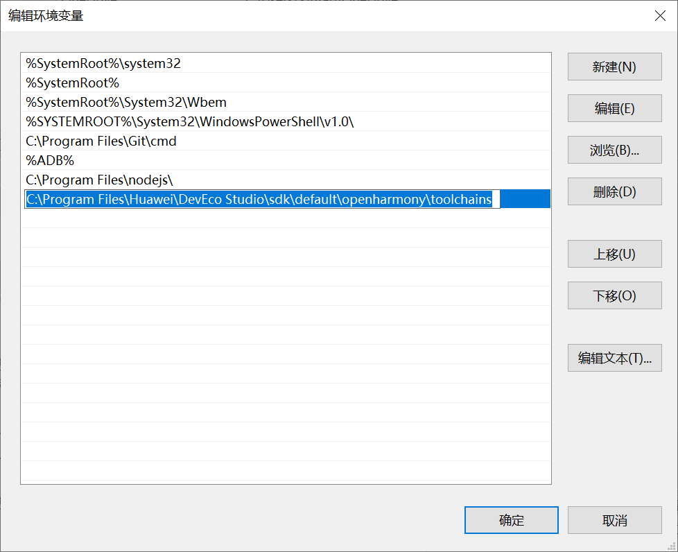
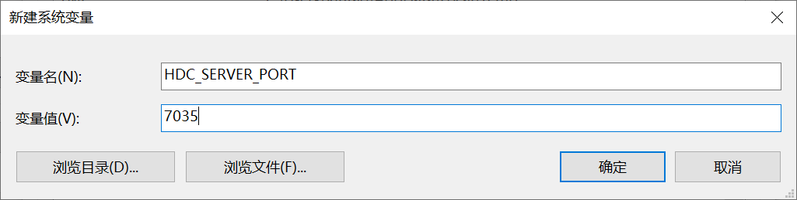
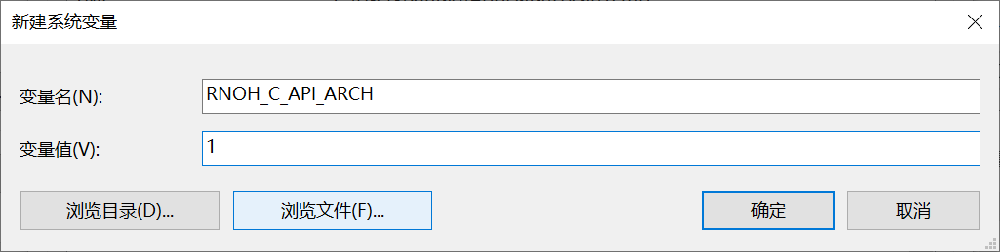

# 开发环境搭建

## 开发环境要求

* 系统：Windows 10 以上， MacOS 13 以上
* Node.js版本： v18 以上
* DevEco Studio版本：5.0.9.200 以上

## Node.js 环境搭建

### 安装 Node.js

#### 通过安装包安装

进入 [Node.js 官网](https://nodejs.org/)，根据操作系统下载对应node.js安装包。下载完后根据提示安装完成。

安装完成后确保 node 命令及 npm 可用

```bash
node -v # 输出版本号例如： v18.17.1

npm -v # 输出版本号例如：9.6.7
```
如上能输出版本信息即可。

#### MacOS 下通过 nvm 安装管理 Node.js

可参考 https://nodejs.org/zh-cn/download 安装 nvm

```bash
# Download and install nvm:
curl -o- https://raw.githubusercontent.com/nvm-sh/nvm/v0.40.3/install.sh | bash

# in lieu of restarting the shell
\. "$HOME/.nvm/nvm.sh"

# Download and install Node.js:
nvm install 22

# Verify the Node.js version:
node -v # Should print "v22.15.0".
nvm current # Should print "v22.15.0".

# Verify npm version:
npm -v # Should print "10.9.2".
```


## 鸿蒙开发环境搭建

### MacOS下搭建鸿蒙开发环境

#### 安装 DevEco Studio

参考华为开发者[文档](https://developer.huawei.com/consumer/cn/doc/harmonyos-guides-V2/software_install-0000001053582415-V2)下载并安装DevEco Studio

#### 添加系统变量

* 添加 hdc 工具目录到系统变量 `PATH` 中

  hdc 是鸿蒙为开发人员提供的命令行调试工具。hdc通过 OpenHarmony SDK 获取，存放在 `toolchains`目录下，一般存放在 DevEco Studio 安装目录下，完整路径如：`/Applications/DevEco-Studio.app/Contents/sdk/default/openharmony/toolchains`

  编辑bash配置文件（例如~/.bash_profile、~/.bashrc 或 ~/.zshrc）,在配置文件添加一行

  ```
  export PATH=$PATH:/Applications/DevEco-Studio.app/Contents/sdk/default/openharmony/toolchains
  ```

* 添加系统变量 `HDC_SERVER_PORT`

  端口号可为任意未被占用的端口，如： `7035`

  编辑bash配置文件（例如~/.bash_profile、~/.bashrc 或 ~/.zshrc）,在配置文件添加一行

  ```
  export HDC_SERVER_PORT=7035
  ```

* 添加系统变量 `RNOH_C_API_ARCH`

  编辑bash配置文件（例如~/.bash_profile、~/.bashrc 或 ~/.zshrc）,在配置文件添加一行

  ```
  export RNOH_C_API_ARCH=1
  ```


### Windows下搭建鸿蒙开发环境

#### 安装 DevEco Studio

参考华为开发者[文档](https://developer.huawei.com/consumer/cn/doc/harmonyos-guides-V2/software_install-0000001053582415-V2)下载并安装DevEco Studio

#### 添加系统变量

* 将 hdc 添加到系统变量`Path`中

  hdc 是鸿蒙为开发人员提供的命令行调试工具。hdc通过 OpenHarmony SDK 获取，存放在 `toolchains`目录下，一般存放在 DevEco Studio 安装目录下，完整路径如：`C:\Program Files\Huawei\DevEco Studio\sdk\default\openharmony\toolchains`

  在`此电脑 > 属性 > 高级系统设置 > 高级 > 环境变量`中，编辑系统变量Path，添加hdc工具所在的完整路径

  

* 添加 HDC_SERVER_PORT 变量

  在`此电脑 > 属性 > 高级系统设置 > 高级 > 环境变量`中，新建一个系统变量，变量名为 `HDC_SERVER_PORT`，变量值可为任意未被占用的端口，如 `7035`

  

* 添加 RNOH_C_API_ARCH 变量

  在`此电脑 > 属性 > 高级系统设置 > 高级 > 环境变量`中，新建一个系统变量，变量名为 `RNOH_C_API_ARCH`，变量值为 `1`

  