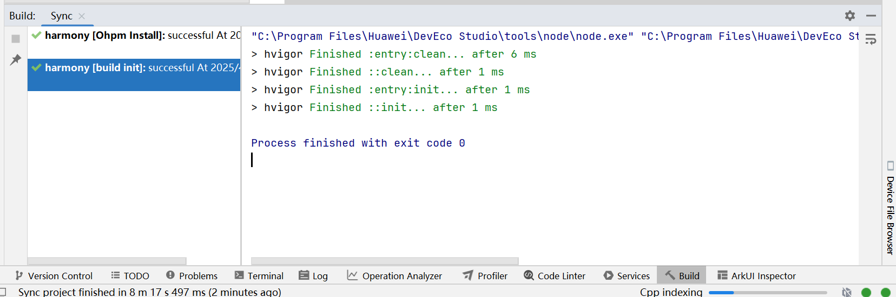
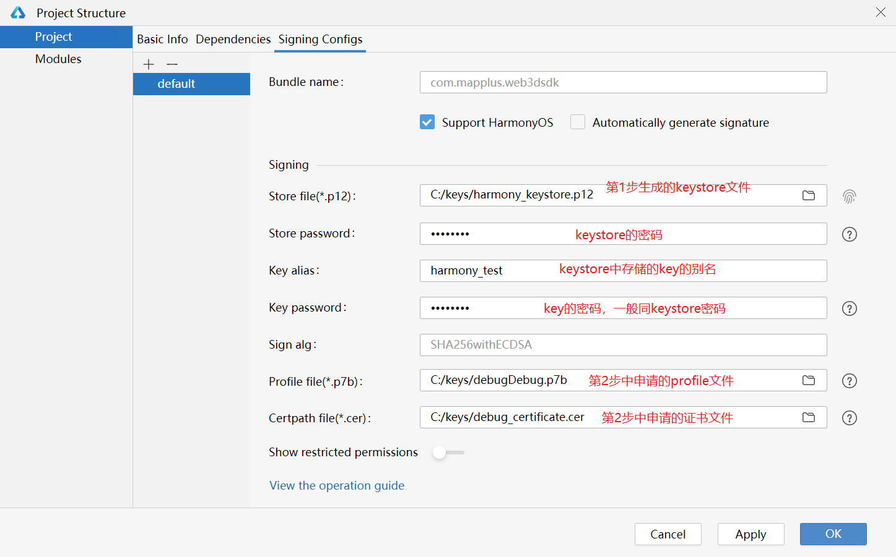

# 运行示例工程

此示例工程基于官方 React Native 0.72 版本，并对鸿蒙平台进行了适配

运行本工程需先进行环境配置，若还没有配置，可参考[开发环境搭建](./开发环境搭建.md)进行配置

## 工程目录

```
--web3dsdk-rn // 根目录
  |
  |--android  // andorid 平台原生代码
  |--ios      // ios 平台原生代码
  |--harmony  // 鸿蒙平台原生代码
  |--docs     // 文档目录
  |--src      // RN 代码入口
     |-App.tsx       // 工程入口
     |-demos         // 示例文件目录
     |-components    // 公共组件
     |-navigators    // App 导航目录
     |-pages         // App 页面

```

## 运行鸿蒙系统

### 1. 添加运行库及资源

本示例需要添加一些依赖及资源才可正常运行。资源可以在配套的资源包中获取。

* 若需要使用图片模型等资源，将 `resource.zip` 复制到 `harmony/entry/src/main/resources/rawfile/resource.zip`

### 2. 安装RN依赖

进入项目根目录，运行

```bash
npm install
```

等待依赖下载完成

### 3. 安装鸿蒙依赖

使用 DevEco Studio 打开工程中的 `harmony`目录

等待 DevEco Studio 自动同步工程。



此步骤可能花费时间较长，请耐心等待同步完成。


### 4. 鸿蒙Codegen

返回项目根目录运行 

```
npm run codegen
```
自动生成鸿蒙侧的C++代码

### 5. 连接真机并签名

真机调试需要对应用进行签名。调试时可以使用手动签名与自动签名对应用进行签名。

* 手动签名

  1. 生成 key 和 csr

      [参考文档](https://developer.huawei.com/consumer/cn/doc/harmonyos-guides/ide-signing#section462703710326)，在 DevEco 中生成 `key(.p12)` 文件和 `csr(.csr)` 文件


  2. 申请证书及Profile

     参考[配置调试证书](https://developer.huawei.com/consumer/cn/doc/app/agc-help-debug-overview-0000001955332054)手动签名流程，申请并下载`调试证书(.cer)`和`Profile(.p7b)`

  3. 配置签名

     在 DevEco Studio `File > Project Structure > Project > Signing Configs` 中，选择生成的证书及签名文件，填如第1步生成的别名和密码，点击`apply`即可

    


* 自动签名

  连接鸿蒙设备后，返回 DevEco Studio，在 `File > Project Structure > Project > Signing Configs` 中，勾选`Automaticcal generate signature`, 登录华为开发者账号后等待签名完成

> 注意!
>
> SDK 激活所需的设备信息与应用包名和签名有关。由于自动签名有效期较短，自动更新后签名会发生改变，导致激活失效。建议使用固定签名进行手动签名以避免签名改变导致的激活失效问题。

### 6. 运行 React Native

运行 React Native 时，可直接启动 Metro 服务，或者将编译好的 bundle.js 放到 harmony 的 rawfile 中直接使用

a. 使用Metro服务器运行

* 启动 Metro 服务

  在rn工程目录运行

  ```bash
   npm run start
  ```
  开始运行 rn Metro 服务，默认运行在本机 `8081` 端口

* 运行鸿蒙工程

  点击运行图标，等待工程编译完成并安装到设备上

  

* 运行后，可在鸿蒙设备上`设置 Metro 服务器地址`或者进行`端口转发`来连接 Metro 服务

  * 设置 RN Metro 服务地址

    进入app后，摇动设备，在弹出的开发者菜单中选择 `Settings`

    点击 `Debug Server host & port for device`, 在弹出的对话框中填写 rn Metro 服务的 ip 地址及端口号，如 `192.168.1.100:8081`

    重启 app 后即连接上 rn 服务，app运行成功。

  * 端口转发

    连接鸿蒙设备，执行命令

    ```bash
    hdc rport tcp:8081 tcp:8081
    ```
    使用端口转发，需要保证设备一直连接。若设备意外断开，需要再次执行此命令

b. 使用编译后的bundle.js

* 编译 bundle.js

  在rn工程目录运行命令进行打包：
  ```bash
  npm run bundle:harmony
  ```
  打包后的`bundle.js`及资源文件会自动复制到 `harmony/entry/src/main/resources/rawfile` 目录

* 运行鸿蒙工程

  点击运行图标，等待工程编译完成并安装到设备上

  

  安装启动后，App及使用内置的 bundle.js 开始运行。

> 注意，这种运行方式每次修改 RN js 侧代码后需要重复上面的两个步骤以更新代码
